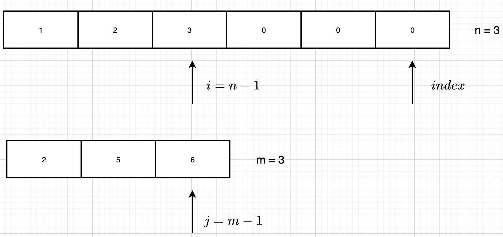
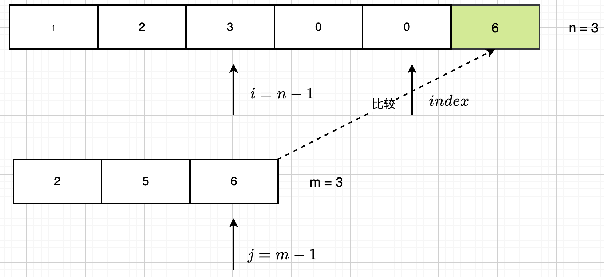

### 88.合并两个有序数组/NC22.合并两个有序数组

给定两个排序后的数组 A 和 B，其中 A 的末端有足够的缓冲空间容纳 B。 编写一个方法，将 B 合并入 A 并排序。

初始化 A 和 B 的元素数量分别为 *m* 和 *n*。

**示例:**

```
输入:
A = [1,2,3,0,0,0], m = 3
B = [2,5,6],       n = 3

输出: [1,2,2,3,5,6]
```

**说明:**

- `A.length == n + m`

题解：

> 双指针
>
> 最优解：从后往前处理,不需要开辟额外空间





```java
class Solution {
    public void merge(int[] A, int m, int[] B, int n) {
        int i = m - 1, j = n - 1, index = m + n - 1;	// index其实就是A的最后一个元素对应的索引
        while (i >= 0 && j >= 0){
            A[index--] = A[i] > B[j] ? A[i--] : B[j--];	// 谁大谁赋值给A，然后向前移动
        }
        while (j >= 0){
            A[index--] = B[j--];	// 收尾，针对i先 等于0的情况
        }
    }
}
```

