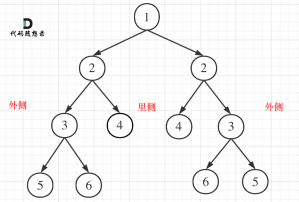

### [剑指 Offer 28/LeetCode101. 对称的二叉树](https://leetcode-cn.com/problems/dui-cheng-de-er-cha-shu-lcof/)

给定一个二叉树，检查它是否是镜像对称的。

 

例如，二叉树 [1,2,2,3,4,4,3] 是对称的。

        1
       / \
      2   2
     / \ / \
    3  4 4  3

但是下面这个 [1,2,2,null,3,null,3] 则不是镜像对称的:

        1
       / \
      2   2
       \   \
       3    3

进阶：

你可以运用递归和迭代两种方法解决这个问题吗？

题解：

>本题遍历只能是“后序遍历”，因为我们要通过递归函数的`返回值`来判断两个⼦树的`内侧节点`和`外侧节点`是否相等。
>
>正是因为要遍历`两棵树`⽽且要⽐较内侧和外侧节点，所以准确的来说是⼀个树的遍历顺序是`左右中`，⼀个树的遍历顺序是`右左中`。
>
>
>
>递归三部曲
>
>```markdown
>1. 确定递归函数的参数和返回值
>因为我们要⽐较的是根节点的两个⼦树是否是相互翻转的，进⽽判断这个树是不是对称树，所以要⽐较
>的是两个树，`参数`⾃然也是左⼦树节点和右⼦树节点。
>`返回值`⾃然是bool类型。
>2. 确定终⽌条件
>要⽐较两个节点数值相不相同，⾸先要把两个节点为空的情况弄清楚！否则后⾯⽐较数值的时候就会操
>作空指针了。
>节点为空的情况有：（注意我们⽐较的其实不是左孩⼦和右孩⼦，所以如下我称之为左节点右节点）
>左节点为空，右节点不为空，不对称，return false
>左不为空，右为空，不对称 return false
>左右都为空，对称，返回true
>此时已经排除掉了节点为空的情况，那么剩下的就是左右节点不为空：
>左右都不为空，⽐较节点数值，不相同就return false
>此时左右节点不为空，且数值也不相同的情况我们也处理了。
>3. 确定单层递归的逻辑
>此时才进⼊单层递归的逻辑，单层递归的逻辑就是处理 右节点都不为空，且数值相同的情况。
>⽐较⼆叉树外侧是否对称：传⼊的是左节点的左孩⼦，右节点的右孩⼦。
>⽐较内测是否对称，传⼊左节点的右孩⼦，右节点的左孩⼦。
>如果左右都对称就返回true ，有⼀侧不对称就返回false 。
>```
>
>

```java
class Solution {
    public boolean isSymmetric(TreeNode root) {
        return root == null ? true : recur(root.left, root.right);
    }
    boolean recur(TreeNode L, TreeNode R) {	//递归函数的参数，左右子树
        if(L == null && R == null) return true;	// 终止条件
        if(L == null || R == null || L.val != R.val) return false;
        return recur(L.left, R.right) && recur(L.right, R.left);	// 返回内、外侧结点
    }
}
```

