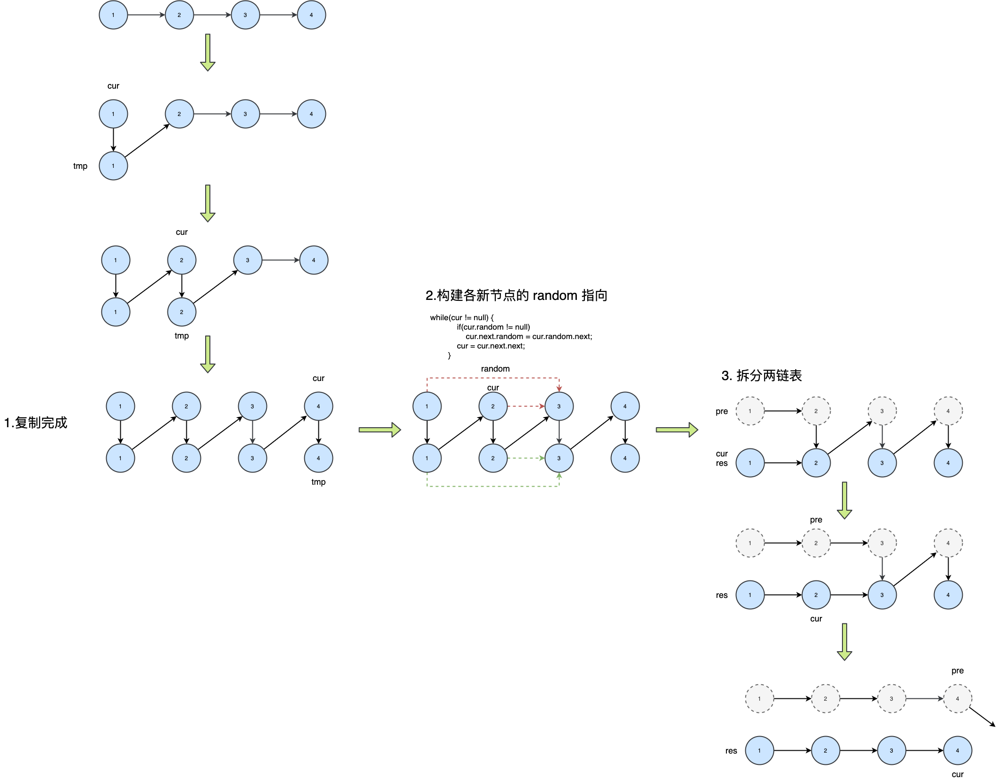

### 剑指 Offer 35/LeetCode138. 复杂链表的复制

请实现 copyRandomList 函数，复制一个复杂链表。在复杂链表中，每个节点除了有一个 next 指针指向下一个节点，还有一个 random 指针指向链表中的任意节点或者 null。

示例 1：


```
输入：head = [[7,null],[13,0],[11,4],[10,2],[1,0]]
输出：[[7,null],[13,0],[11,4],[10,2],[1,0]]
```

示例 2：

```
输入：head = [[1,1],[2,1]]
输出：[[1,1],[2,1]]
```

示例 3：

```
输入：head = [[3,null],[3,0],[3,null]]
输出：[[3,null],[3,0],[3,null]]
```

示例 4：

```
输入：head = []
输出：[]
解释：给定的链表为空（空指针），因此返回 null。
```


提示：

- `-10000 <= Node.val <= 10000`
- `Node.random `为空（null）或指向链表中的节点。
- 节点数目不超过 1000 。

注意：本题与主站 138 题相同：https://leetcode-cn.com/problems/copy-list-with-random-pointer/

题解：

>```java
>// Definition for a Node.
>class Node {
>    int val;
>    Node next, random;
>    public Node(int val) {
>        this.val = val;
>        this.next = null;
>        this.random = null;
>    }
>}
>```
>
>以上是随机链表的数据结构，多了一个random指针

拼接 + 拆分

1、先复制结点，拼接一个链表





```java
class Solution {
    public Node copyRandomList(Node head) {
        if(head == null) return null;
        Node cur = head;
        // 1. 复制各节点，并构建拼接链表
        while(cur != null) {
            Node tmp = new Node(cur.val);
            tmp.next = cur.next;
            cur.next = tmp;
            cur = tmp.next;	// cur到下一个结点
        }
        // 2. 构建各新节点的 random 指向
        cur = head;
        while(cur != null) {
            if(cur.random != null)
                cur.next.random = cur.random.next;
            cur = cur.next.next;	// 现在是两倍长的链表，跳两步
        }
        // 3. 拆分两链表
        cur = head.next;
        Node pre = head, res = head.next;
        while(cur.next != null) {
            pre.next = pre.next.next;	// 或者 pre.next = cur.next;
            cur.next = cur.next.next;
            pre = pre.next;
            cur = cur.next;
        }
        pre.next = null; // 单独处理原链表尾节点
        return res;      // 返回新链表头节点
    }
}
```

哈希

```java
class Solution {
    public Node copyRandomList(Node head) {
        if(head == null) return null;
        Node cur = head;
        Map<Node, Node> map = new HashMap<>();
        // 3. 复制各节点，并建立 “原节点 -> 新节点” 的 Map 映射
        while(cur != null) {
            map.put(cur, new Node(cur.val));
            cur = cur.next;
        }
        cur = head;
        // 4. 构建新链表的 next 和 random 指向
        while(cur != null) {
            map.get(cur).next = map.get(cur.next);
            map.get(cur).random = map.get(cur.random);
            cur = cur.next;
        }
        // 5. 返回新链表的头节点
        return map.get(head);
    }
}
```

